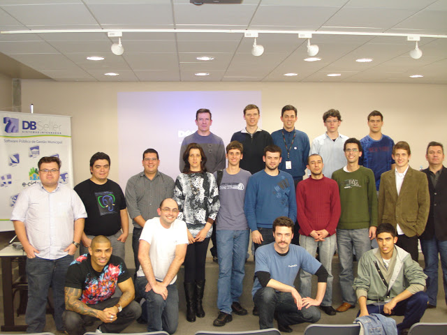

Title: PGDay RS 2011
Date: 2011-06-02 19:10
Category: Eventos
Author: guedes
Tags:

[**FOTOS PGDay/RS 2011**](https://picasaweb.google.com/112690003264111917562/PGDay#)

**INCRIÇÕES ONLINE ENCERRADAS!**

**ATENÇÃO!** Inscrições online encerradas. Novas inscrições poderão ser realizadas somente no local do evento.

Cheguem cedo, o evento começa as 08:30h e temos poucas vagas não preenchidas das **150 vagas** disponíveis.

Caso você tenha se inscrito online e não esteja no local do evento no horário previsto, sua vaga poderá ser re-alocada para alguém que estiver na fila de espera.

 

A inscrição para o evento será apenas 1Kg de alimento não perecível, que será doado para:

- **Centro Comunitário Vila Orfanatrófio I**
- Rua Osmar dos Santos Freitas, 40, Alto Teresópolis
- Fone (51) 3062-8064
- Site [http://www.cencor1.no.comunidades.net/](http://www.cencor1.no.comunidades.net/)
- O centro realiza atendimento a certa de 250 crianças e adolescentes, distribuídos entre a Creche Boa Esperança, o Serviço de Atendimento Sócio Educativo (SASE) do Núcleo de Meninos e Meninas São José e o trabalho educativo na padaria e confeitaria da comunidade.

 
##O que é?##

Postgres ou [PostgreSQL](http://www.postgresql.org/) é um projeto de Sistema Gerenciador de Banco de Dados open-source que foi iniciado em 1986, na Universidade de Berkeley, na Califórnia.

[PGDay](http://www.postgresql.org.br/eventos/pgday), ou [Dia do Postgres](http://www.postgresql.org.br/eventos/pgday), é um evento não tão formal quanto o [PGBR](http://pgbr.postgresql.org.br/) (Conferência sobre PostgreSQL no Brasil) e de caráter regional, podendo ser realizado com poucas pessoas em qualquer/vários estados do País.

##Quais são os objetivos?##

É uma chance para que acadêmicos, DBAs e desenvolvedores Brasileiros de PostgreSQL aprendam, troquem experiências, exponham casos de sucessos, desafios e fortifiquem sua rede de relacionamento profissional.

##Qual o público alvo?##

Dentre o público esperado estão:

- Administradores de Bancos de Dados;
- Acadêmicos de Cursos Técnicos ou Universidades;
- Desenvolvedores de Softwares;
- Organizações governamentais;
- Entusiastas de Software Livre.

##Data e Local##

O evento será dia 19 de Agosto de 2011, no Auditório do Bloco D da [Uniritter](http://www.uniritter.edu.br/) localizado na Rua Orfanotrófio, 555, bairro Alto Teresópolis CEP: 90840-440 em Porto Alegre, RS.

[Exibir mapa ampliado](http://maps.google.com/maps/place?cid=10022967059912209148&q=ua+Orfanotr%C3%B3fio,+555,+bairro+Alto+Teres%C3%B3polis+CEP:+90840-440,+porto+alegre&hl=en&cd=1&cad=src:ppiwlink&ei=kmAwTrGmMaCOzAW6p9CMAw)

##Submissão de Palestras##

Gostaria de palestrar neste evento? Preencha o [formulário de submissão aqui](https://spreadsheets0.google.com/spreadsheet/viewform?hl=en_US&hl=en_US&formkey=dG5JbGVlYUxnYlpwdWF4ejhUUHRlSUE6MQ#gid=0) e observe abaixo as datas importantes:

- 15/07/2011   Prazo limite para submissão de propostas
- 27/07/2011   Notificação de aceitação ao(s) autor(es)
- 27/07/2011   Confirmação, por parte do(s) autor(es), da participação no evento

**Grade do evento fechada**

O evento não tem como prover qualquer eventual despesa que o palestrante tenha para poder participar do mesmo, ou seja, as despesas ficam por conta do próprio palestrante.

##Palestrantes confirmados##

- [Dickson S. Guedes](https://www.postgresql.org.br/eventos/pgday/rs#): atua há mais de 10 anos na área de Tecnologia da Informação com experiência na administração de ambientes de missão crítica. Vivência na área de administração de banco de dados e de administração de servidores. É membro da Equipe de Organização da Comunidade Brasileira de PostgreSQL, bem como, contribui com testes, patches e nas listas de discussões. Autor do pgxn_utils - uma ferramenta que permite facilmente iniciar uma nova extensão no PostgreSQL, empacotá-la e publica-la na PGXN. Atualmente atua na administração de banco de dados PostgreSQL em ambiente OLTP.

- [Diego Rossi](https://www.postgresql.org.br/eventos/pgday/rs#): atualmente atua no ramo de educação e programação. É Tecnólogo em Análise e Desenvolvimento de Sistemas, formado pela Faculdade de Ciências e Letras Santa Marcelina. Como empreendedor tem estudado bastante as novas tecnologias aliando o seu uso para beneficiar empresas.

- [Diogo Biazus](https://www.postgresql.org.br/eventos/pgday/rs#): é consultor de banco de dados, instrutor na TargetTrust Informática e estudante de Ciência da Computação na UFRGS. Também colabora com os grupos de usuários de PostgreSQL nacional e internacional sempre que possível, sendo um dos co-mantenedores do [www.postgresql.org.br](http://www.postgresql.org.br/).

- [Eduardo Wolak](https://www.postgresql.org.br/eventos/pgday/rs#): trabalha a mais de 20 anos com desenvolvimento de sistemas de gestão, análise e mapeamento de processos, consultoria e implantação de sistemas ERP.

- [Fabiano Machado Dias](https://www.postgresql.org.br/eventos/pgday/rs#): atua a mais de 12 anos na área de desenvolvimento de sistemas de gestão, tem experiência em servidores Linux e trabalha com PostgreSQL desde a versão 7.2.

##Grade atual##

As palestras terão duração de cinquenta minutos, sendo quarenta deles destinado à palestra propriamente dita, e os dez restantes destinados à perguntas.

| **Horário** | **Atividade** |
|---|---|
| 08:30	| **Abertura** |
| 09:00 | PgFouine, a consultoria que você precisa no PostgreSQL que você tem (Diego Rossi) |
| 10:00	| PL/pgSQL na Prática (Fabiano Machado Dias e Eduardo Wolak) |
| 11:00 | PGXN - Como distribuir suas extensões com o PostgreSQL (Dickson S. Guedes) |
| 12:00 | **Almoço** |
| 14:00	| Dojo PL/pgSQL (Diogo Biazus) |
| 16:00 | **Coffee-Break** |
| 16:30	| Lightning Talks |
| 17:00	| **Encerramento** |

 
##Organizadores##

- Fabrízio de Royes Mello - [fabriziomello@gmail.com](fabriziomello@gmail.com)
- Guilherme Silva de Lacerda - [guilhermeslacerda@gmail.com](guilhermeslacerda@gmail.com)

##Apoio:##

[**UniRitter - Centro Universitário Ritter**](http://www.uniritter.edu.br/)

A [Targettrust](http://www.targettrust.com.br/) irá sortear 1 (um) curso de 20h da Formação PostgreSQL dentre os participantes que estiver presente no dia do evento.

O sorteado(a) poderá escolher 1 (um) dos cursos:

- PostgreSQL Fundamentos (20h)
- PostgreSQL Procedural (20h)
- PostgreSQL Administração (20h)
- PostgreSQL Administração Avançada (20h)

