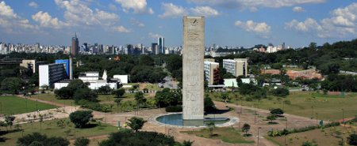

Title: PGDay SP - São Paulo 2012 
Date: 2012-09-14 08:18 
Category: Eventos
Author: telles
Tags:

##Local

**USP - Universidade de São Paulo**  
IME - Instituto de Matemática e Estatística
Rua do Matão, 1010 - Cidade Universitária - São Paulo - SP
Bloco B, Sala B5

##Data

09/11/2012 - Das 13:30 às 21:30

Transmissão ao vivo pela IPTV USP.  
Acompanhe o evento ao vivo pelo site do [IPTV USP](http://iptv.usp.br/portal/home.jsp?tipo=1&_EntityIdentifier=usph-_47lKDTGJBkYK9ksO6Nw7FeBZnlMG87qQugwQUu8g.&#).

##Inscrições

- Faça sua inscrição [AQUI](https://docs.google.com/spreadsheet/viewform?formkey=dDRZazFCNktCSjlvNHhYNnlPczcwY2c6MA).
- A entrada será franca, mas todos deverão se inscrever pelo site do evento.
- As vagas são limitadas.

##Programação*

| Horário | Atividade |
|---|---|---|
| 13:30 | Abertura |
| 14:00 | Desmistificando Replicação no PostgreSQL |
| 15:00 | Fazendo uma manada de elefantes passar por baixo da porta |
| 16:00 | Intervalo |
| 16:30 | Meu ambiente cresceu e eu não planejei. E agora? |
| 17:30 | O Elefante em Contêiner - PostgreSQL Virtualizado e Performático no OpenVZ |
| 18:30 | Intervalo |
| 19:30 | Versionamento de camadas com PostGIS |
| 20:30 | PostgreSQL e NoSQL - o melhor dos dois mundos |
| 21:30 | Mesa Redonda: Postgres Market Share e os desafios no mercado de SGDBs. Mediador: Prof. João Eduardo Ferreira |

 *Sujeito a alterações

##Palestras Confirmadas

- **EVERALDO CANUTO**
- **Título**: PostgreSQL e NoSQL - o melhor dos dois mundos
- **Descrição**: Por anos estivemos acostumados com bancos de dados SQL até que recentemente o mercado explodiu com ofertas de bancos NoSQL. Mas e se pudéssemos ter o melhor dos dois mundos, mantendo as facilidades para desenvolvimento NoSQL sem perder as vantagens das consultas SQL.
- **Mini Currículo**: Desenvolvedor livre e administrador de rede. Fez seu primeiro programa de computador aos 11 anos num MSX, contribui e mantém alguns projetos livres e recentemente tem se dedicado aos bancos de dados PostgreSQL e MySQL. Nas horas vagas assiste seriados de TV e tenta tocar violão.
   
- **EULER TAVEIRA**
- **Título**: Desmistificando Replicação no PostgreSQL
- **Descrição**: Quando pensamos em garantir a continuidade das atividades de um SGBD, o primeiro conceito que vem a cabeça é "replicação". A ideia é manter uma cópia do conjunto de dados em um servidor remoto. Como há muitas maneiras de fazer replicação, as técnicas são amplamente debatidas.
Nesta palestra iremos abordar os conceitos para ajudá-los a entender as opções disponíveis. Termos como "cluster", "switchover", "high availability", "failback" e "standby" são conceitos utilizados em SGBDs; veremos como eles se encaixam em cada uma das técnicas disponíveis para PostgreSQL.  Apresentaremos as ferramentas de replicação mais populares (nativo, Slony-Ipgbr.postgresql.org.br/2011/imgs/utah.png, Londiste, Bucardo, pgpool-II) e algumas em desenvolvimento (lógica, Postgres XC), apontando os seus pontos positivos e negativos.
- **Mini Currículo**: Diretor Técnico da Timbira. Membro da equipe de desenvolvimento do PostgreSQL. Especialista em banco de dados. Palestrante regular em diversas conferências nacionais e internacionais.
Além de contribuir com desenvolvedor e revisor de patches, é o mantenedor das traduções para português do PostgreSQL e alguns projetos relacionados. Ele também é (co-)autor de algumas extensões (como pg_similarity e pgspy) e, uma vez ou outra, contribui com correções para projetos relacionados.
Trabalha com PostgreSQL desde a versão 6.5 e atualmente é um dos líderes do PostgreSQL Brasil. Ganha a vida trabalhando na Timbira, onde ele trabalha em consultoria, suporte, treinamento e desenvolvimento de funcionalidades patrocinadas.

- **FÁBIO TELLES RODRIGUEZ**
- **Título**: Fazendo uma manada de elefantes passar por baixo da porta
- **Descrição**: Trabalhar com alta concorrência em banco de dados exigem muitos cuidados. Esta palestra visa exibir alguns cuidados e boas práticas no desenvolvimento de aplicações OLTP com alta concorrência. Os cuidados vão da configuração do hardware, SO, storage e do PostgreSQL, até a modelagem de dados, ajustes de parâmetros individuais em alguns objetos e principalmente: ajuste de processos na aplicação.
- **Mini Currículo**: Fábio Telles é DBA há 10 anos, já foi colaborador no CDI-SP, PSL-ABCD, Debian Zine e atuamente contribui com a Comunidade Brasileira de PostgreSQL.
Já foi palestrante em diversos eventos  e possui artigos publicados e vários locais e se dedica ao seu blog, o "SAVEPOINT" em http://tellesr.wordpress.com/. 
Atualmente trabalha na Bull e é presta consultoria pela Timbira onde é Diretor.

- **FLAVIO HENRIQUE ARAQUE GURGEL**
- **Título**: Meu ambiente cresceu e eu não planejei. E agora?
- **Descrição**: Até ontem estava tudo bem. O sistema funcionava que era uma maravilha. Os usuários eram felizes.
Nesta manhã, em torno das 11h, meu telefone celular tocou. Interrompi um dia de descanso que combinei com meu chefe. Era ele. Ele gritava: "Esse tal de PostgreSQL que você instalou aqui na empresa, tá lento que é um inferno! O ambiente tá todo lento feito uma carroça. Tão dizendo que tem um tal de autovacuum que tá ferrando tudo!. Dá pra você vir aqui logo?!? O pessoal já quer fazer um reindex de uma vez, posso mandar fazer? Vou liberar uma máquina melhor aqui, mas ela custa caro e é do outro projeto, viu?"
Esse tipo de acontecimento é muito, mas muito mais comum do que se imagina no mundo dos bancos de dados, inclusive do PostgreSQL.  
Nesta palestra:
- os mitos que muita gente acha que causam problemas;
- as verdades que realmente causam problemas;
- o que fazer numa urgência de má performance, táticas de guerra;
- o poderia ser feito antes disso tudo;
- exemplos reais;
- o que devo monitorar;
- como escalar o PostgreSQL e investir melhor na infraestrutura.
- **Mini Currículo**: Flavio Henrique Araque Gurgel é instrutor e consultor de bancos de dados da 4Linux, engenheiro eletricista pela Universidade Federal do Paraná (UFPR). Atua em projetos de dimensionamento, tuning de bases de dados, suporte aos clientes e liderança da equipe de projetos.

- **JULIANO ATANAZIO**
- **Título**: O Elefante em Contêiner - PostgreSQL Virtualizado e Performático no OpenVZ
- **Descrição**: Quando falamos em Virtualização, para muitos é um assunto "proibido" para bancos de dados. O que acontece é que há mitos e verdades que devem ser devidamente esclarecidos para podermos usufruir dos benefícios dessa tecnologia aplicada a bancos de dados. Como Fazer? O que devemos considerar? Performance baixa?
Essas e outras respostas devidamente esclarecidas e a apresentação da tecnologia de virtualização em contêineres com o OpenVZ, que é uma ferramente open source com alto desempenho, que para bases de dados torna a virtualização além de viável, altamente compensadora e frutífera.
- **Mini Currículo**:Formado na FATEC Sul, no curso de "Informática para Gestão de Negócios". Consultor e Instrutor de bancos de dados PostgreSQL e Virtualização com OpenVZ, KVM e Proxmox. Adminstrador de Servidores Linux, certificado LPIC nível 2.

- **MATHEUS RICARDO ESPANHOL**
- **Título**: Versionamento de camadas com PostGIS
- **Descrição**: Com a evolução dos Sistemas de Informação Geográfica (SIG), ferramentas web e desktop precisam se comunicar e armazenar dados espaciais garantindo a segurança e recuperação. Assim como em um ambiente de desenvolvimento de software, analistas GEO precisam alterar e publicar dados espaciais de forma concorrente. A ferramenta pgVersion, desenvolvida pelo alemão Horst Duester, permite o versionamento de camadas no banco de dados PostgreSQL com a extensão PostGIS. Inspirada em softwares como CVS e subversion, ela possui funcionalidades avançadas que contribuem no gerenciamento de SIGs complexos. 
- **Mini Currículo**: Matheus Ricardo Espanhol é consultor de banco de dados pela Dextra Sistemas, membro ativo da comunidade brasileira de PostgreSQL (PGBR). Atua na área há mais de seis anos implantando ambientes de banco de dados de alta disponibilidade e desempenho, além de ministrar treinamentos na área para empresas privadas e orgãos do governo em todo o Brasil.

##Organização

  

##Patrocínio

  
