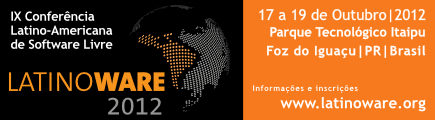

Title: Latinoware apoia bancos de dados livres 
Date: 2012-09-24 13:49 
Category: Início
Author: eduardosan
Tags: postgresql, Latinoware, LatinoDB

Pela primeira vez dentro dos eventos de software livre brasileiros os bancos de dados livres terão um espaço especial. Com o apoio da comunidade PostgreSQL-BR, durante a [Latinoware 2012](http://2012.latinoware.org/), o espaço LatinoDB será dedicado para o levantamento de discussões relevantes sobre o tema.

Segundo Eduardo Santos, membro da comunidade PostgreSQL-BR, “a Latinoware mais uma vez inova ao abrir espaço para a discussão do tema.O momento não poderia ser mais propício, dado o crescimento dos bancos de dados não relacionais (NoSQL) e suas implicações para os produtos tradicionais. Ao convidar especialistas de ambas as áreas, abre-se espaço para interessantes debates”.

Dentre os temas abordados estão bancos de dados não relacionais (NoSQL), armazenamento na nuvem (cloud computing), resolução de problemas e questões sobre performance em ambientes extremamente críticos. As palestras englobarão todo o tipo de público, desde administradores de dados (DBA’s) experientes até mesmo programadores que estão começando a modelar suas primeiras aplicações.
